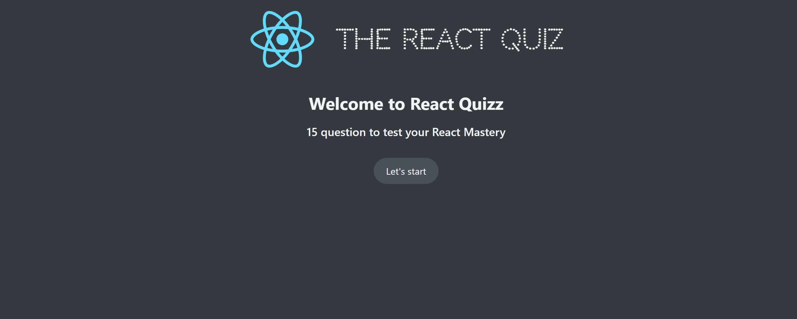
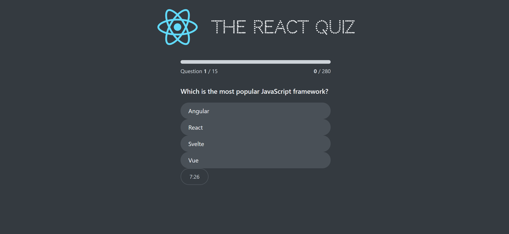

# React Quiz Master

## Description:

React Quiz Master is an engaging and interactive quiz application built with React. This project uses a JSON server as the backend to manage questions and answers. It is designed to provide an enjoyable learning and testing experience.

## Features

Interactive quiz interface
JSON-server backend for questions and answers
Real-time feedback for quiz responses
Easy to customize with your own questions
Responsive and user-friendly design
Demo

## Usage

- Clone the Repository:
  git clone https://github.com/byunn90/ReactQuizMaster.git
- Navigate to the Project Directory:
  cd ReactQuizMaster
- Install Dependencies:
  npm install
- Start the Application:
  npm start
- Backend: Run the json-server for mock data:
  npm run server
- Access the Application:
  Open http://localhost:3000 in your browser to use the quiz app.
  Mock API data will be available at http://localhost:9000/questions.

## Technologies Used

Frontend: React, CSS
Backend: JSON-server

## Link

https://graceful-bonbon-b7ce8e.netlify.app/
